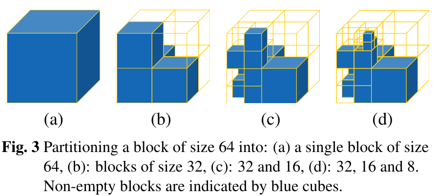

# LEARNING-BASED LOSSLESS COMPRESSION OF 3D POINT CLOUD GEOMETRY

[[Paper]](https://arxiv.org/abs/2011.14700)

Authors:
[Dat Thanh Nguyen](https://scholar.google.com/citations?user=uqqqlGgAAAAJ&hl=en)
[Maurice Quach](https://scholar.google.com/citations?user=atvnc2MAAAAJ),
[Giuseppe Valenzise](https://scholar.google.com/citations?user=7ftDv4gAAAAJ) and
[Pierre Duhamel](https://scholar.google.com/citations?hl=en&user=gWj_W9YAAAAJ)  
Affiliation: L2S, CNRS, CentraleSupelec  
